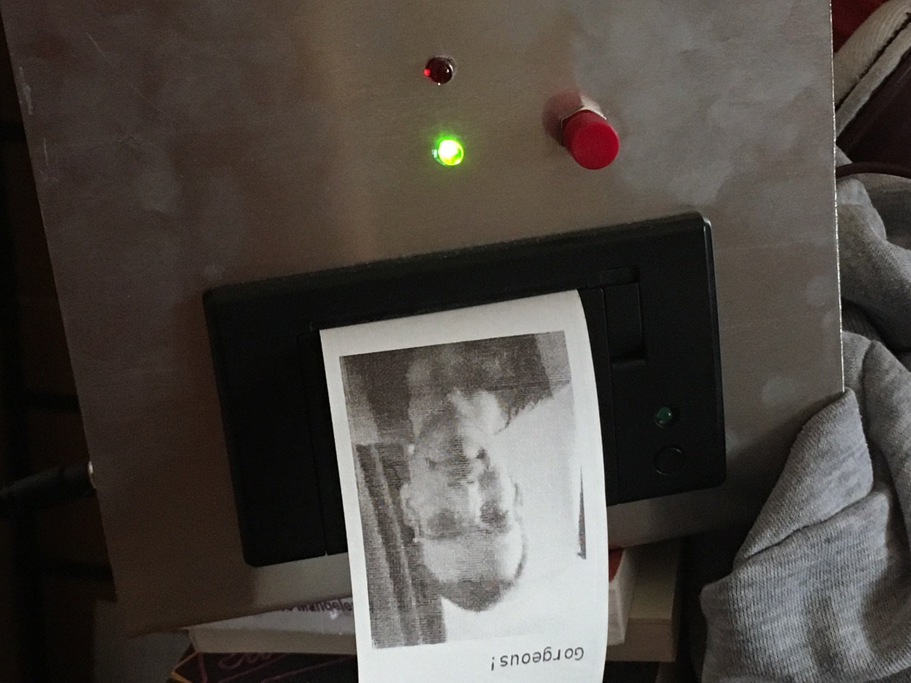

# photo-booth
a box that lets you take a photo with a raspberry pi camera and print it out as a b/w bitmap on a thermal printer along with a compliment.

## material
* raspberry pi zero w
* raspberry pi camera v2
* thermal printer from adafruit or sparkfun
* 2 leds
* 2 buttons

## setup
I followed [this](http://scruss.com/blog/2015/07/12/thermal-printer-driver-for-cups-linux-and-raspberry-pi-zj-58/comment-page-1/) guide to set up the printer. I couldn't connect in the printer service menu though, so I had to reinstall cups and restart the service.

  sudo apt install cups --reinstall
  sudo service cups restart

I set the feed after print to 3mm. The last step was to add

  sh /home/pi/photo-booth/photo-booth.sh

to the /etc/rc.local file just before the 'exit 0' line.

## to do
* [x] do I want to flip the photo
* [x] create bigger compliments.txt
